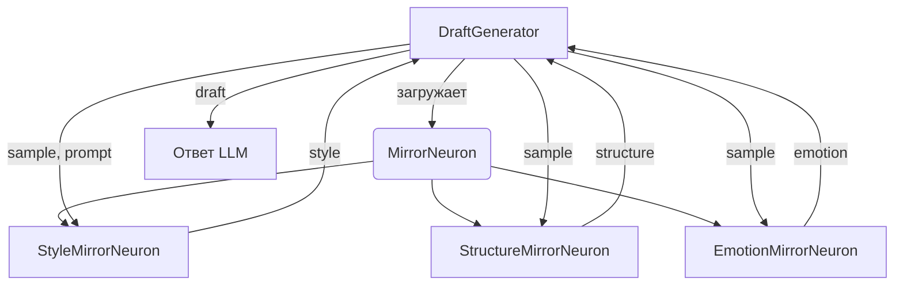

# Mirror Neurons Architecture

Mirror Neurons — это модульные компоненты для анализа и воспроизведения стилистических характеристик текста. Каждый нейрон анализирует образец текста и извлекает специфические паттерны (стиль, структура, эмоциональный тон), которые затем воспроизводятся при генерации ответов.

**Применение:** Создание ответов LLM, сохраняющих стиль, структуру или эмоциональный тон исходного материала (документация, письма, учебные материалы). Базовый класс `MirrorNeuron` дополнительно повторяет регистр текста и последний символ, поэтому даже простые нейроны наследуют общие правила оформления.

---

## 🧠 Архитектура



### Основные классы

- **`BaseNeuron`** — абстрактный класс с методами `analyze()` и `generate()`
- **`MirrorNeuron`** — базовая реализация для зеркальных нейронов
- **`DraftGenerator`** — загружает нейроны из конфигурации и формирует черновики

---

## 📦 Готовые нейроны

### 1. StyleMirrorNeuron

**Ключевые шаги алгоритма (`src/generator/neurons/StyleMirrorNeuron.js`):**

- Разбивает вход на предложения по `[.!?]+`, чистит пробелы и пустые куски.
- Для каждого предложения считает количество слов; `avgSentenceLength` — среднее (0, если предложений нет).
- `punctuationFrequency` = число знаков пунктуации (`[.,!?:;]`) / количество слов.
- `formality` — `informal`, если доля сокращений (`\b\w+'[a-zA-Z]+\b`) больше 5 %, иначе `formal`.
- При генерации строит базовое предложение (формальное/неформальное), добивает его длину до среднего и завершает `!`, если частота пунктуации > 0.2, иначе `.`.

**Пример входа/выхода из кода:**

```javascript
const StyleMirrorNeuron = require('./src/generator/neurons/StyleMirrorNeuron');

const neuron = new StyleMirrorNeuron();
const sample = "Hello! This is a test. How are you doing today? I'm fine.";

console.log(neuron.analyze(sample));
// { avgSentenceLength: 3, punctuationFrequency: 0.333..., formality: 'informal' }

console.log(neuron.generate({ text: 'Base' }));
// Hey this is an informal sentence!
```

---

### 2. StructureMirrorNeuron

**Ключевые шаги (`src/generator/neurons/StructureMirrorNeuron.js`):**

- Наследует базовые признаки из `MirrorNeuron` (`isUpper`, `isLower`, `lastChar`).
- Разбивает текст на предложения регэкспом `[^.!?]+[.!?]`.
- Классифицирует тип предложения по последнему символу (`?`, `!`, иначе утверждение), сохраняет порядок `order` и счётчики `structure`.
- Ищет пассивный залог по регулярке `\b(be|am|is|are|was|were|been|being)\b\s+\w+ed\b` и считает долю `passiveRatio`.
- При генерации идёт по `order`, подставляет активные/пассивные шаблоны, число пассивных предложений ≈ `passiveRatio * order.length`, затем применяет `mirror()` (регистр/последний символ).

**Пример входа/выхода:**

```javascript
const StructureMirrorNeuron = require('./src/generator/neurons/StructureMirrorNeuron');

const neuron = new StructureMirrorNeuron();
const sample = "The book was written by John. Who read it? Amazing story!";

console.log(neuron.analyze(sample));
// {
//   isUpper: false,
//   isLower: false,
//   lastChar: '!',
//   structure: { declarative: 1, interrogative: 1, exclamatory: 1 },
//   order: [ 'declarative', 'interrogative', 'exclamatory' ],
//   passiveRatio: 0
// }

console.log(neuron.generate({ text: 'Base' }));
// The cat eats the food. Does the cat eat the food? The cat eats the food!
```

---

### 3. EmotionMirrorNeuron

**Ключевые шаги (`src/generator/neurons/EmotionMirrorNeuron.js`):**

- Вызывает `super.analyze()` и добавляет детекцию эмоции по словарю `happy/sad/angry` (в нижнем регистре).
- Берёт первую найденную эмоцию, иначе `neutral`.
- При генерации вызывает `super.generate(context)` для применения регистра/последнего символа, затем добавляет подпись эмоции (`Yay! 😊`, `Oh no... 😢`, `Grr! 😠`).

**Пример входа/выхода:**

```javascript
const EmotionMirrorNeuron = require('./src/generator/neurons/EmotionMirrorNeuron');

const neuron = new EmotionMirrorNeuron();
const sample = "I'm so happy and excited about this news! What a joy!";

console.log(neuron.analyze(sample));
// { isUpper: false, isLower: false, lastChar: '!', emotion: 'happy' }

console.log(neuron.generate({ text: 'Great update' }));
// Great update! Yay! 😊
```

---

## ⚙️ Конфигурация

В `config/config.json` укажите список нейронов для активации:

```json
{
  "mirrorNeurons": [
    "StyleMirrorNeuron",
    "StructureMirrorNeuron",
    "EmotionMirrorNeuron"
  ]
}
```

---

## 🔨 Создание собственного нейрона

### Шаг 1: Создайте класс

Создайте файл `src/generator/neurons/MyCustomNeuron.js` (подробный гайд — в `docs/custom-neuron-tutorial.md`).

### Шаг 2: Экспортируйте и включите в конфиг

- Добавьте класс в `src/generator/neurons/index.js`, чтобы DraftGenerator мог его создать по имени.
- Пропишите имя в `mirrorNeurons` внутри `config/config.json`.

### Шаг 3: Проверьте

Запустите `DraftGenerator` с тестовым `hotCache` и убедитесь, что вывод содержит следы вашего нейрона (логика генерации). См. полный пошаговый пример в `docs/custom-neuron-tutorial.md`.

---

## 🔄 Последовательность работы

```
┌─────────────────┐
│ 1. analyze()    │  ← Каждый нейрон анализирует образец
└────────┬────────┘
         │
         v
┌─────────────────┐
│ 2. generate()   │  ← Генерация на основе паттернов
└────────┬────────┘
         │
         v
┌─────────────────┐
│ 3. Объединение  │  ← DraftGenerator собирает черновик
└─────────────────┘
```

**Пример полного цикла:**

```javascript
const generator = new DraftGenerator({
  mirrorNeurons: ['StyleMirrorNeuron', 'EmotionMirrorNeuron']
});

// Образец
const sample = "I'm so excited! This is amazing. What a great day!";

// Генерация
const draft = await generator.generate({
  sample,
  prompt: "Write about new features"
});

// Результат будет:
// - Короткие предложения (как в образце)
// - Восклицательные знаки
// - Позитивный эмоциональный тон
```

---

## 🎯 Best Practices

1. **Выбирайте нейроны по задаче:**
   - Документация → `StyleMirrorNeuron`
   - Маркетинг → `EmotionMirrorNeuron`
   - Научные тексты → `StructureMirrorNeuron`

2. **Комбинируйте нейроны:**
   ```json
   {
     "mirrorNeurons": ["StyleMirrorNeuron", "StructureMirrorNeuron"]
   }
   ```

3. **Тестируйте на образцах:**
   - Используйте реальные тексты из `memory/answers/`
   - Сохраняйте эталоны в `memory/drafts/`

4. **Расширяйте словари:**
   - Для `EmotionMirrorNeuron` добавьте больше эмоций
   - Адаптируйте под свой язык (русский/английский)

---

## 📚 Интеграция с памятью плагина

Нейроны работают с файлами из `memory/`:

```javascript
// 1. Загрузите образец из памяти
const sample = await readMemoryFile('memory/answers/style_guide.md');

// 2. Проанализируйте
const neuron = new StyleMirrorNeuron();
neuron.analyze(sample);

// 3. Сгенерируйте ответ
const draft = neuron.generate({ text: 'New content' });

// 4. Сохраните результат
await saveMemoryFile('memory/drafts/new_draft.md', draft);
```

---

## 🐛 Отладка

Включите debug-логирование:

```javascript
const neuron = new StyleMirrorNeuron();
neuron.debug = true;

neuron.analyze("Sample text");
// [StyleMirrorNeuron] avgSentenceLength: 5.2
// [StyleMirrorNeuron] punctuationFrequency: 0.15
// [StyleMirrorNeuron] formality: formal
```

---

**Автор документации:** Claude (AI Assistant)
**Последнее обновление:** 2025-11-20 → обновлено 2026-02-09
